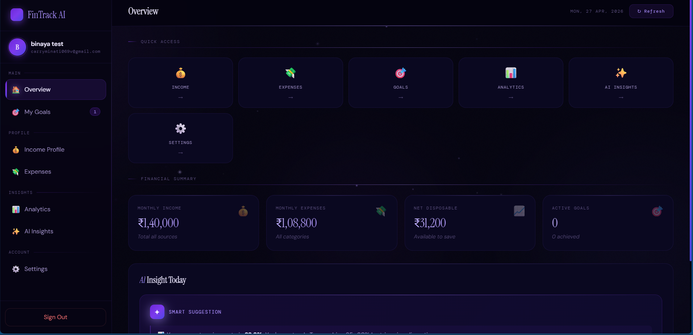
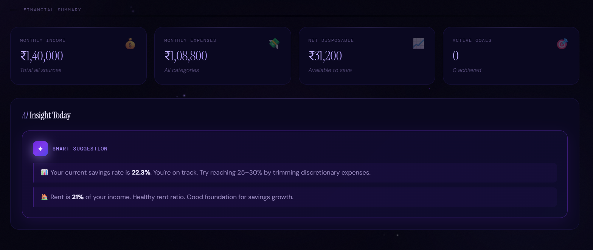
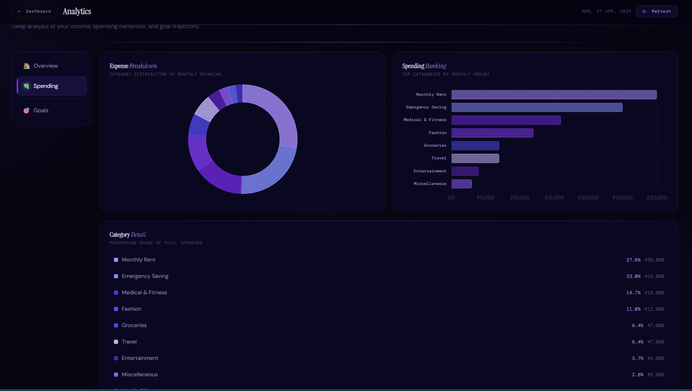
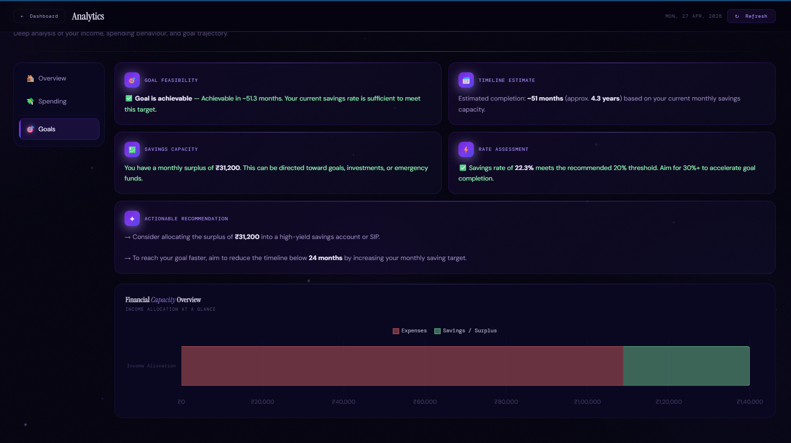
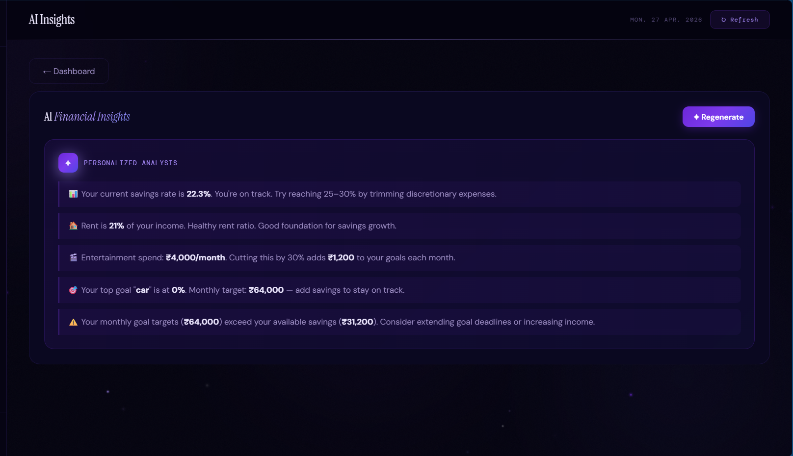
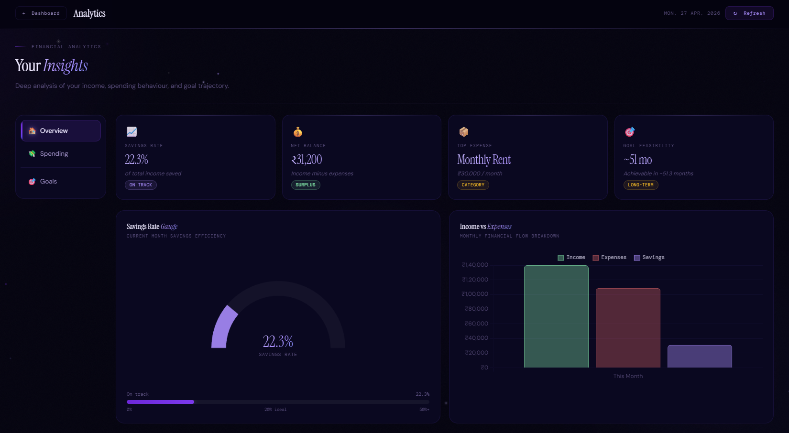

# FinTrack AI — Personal Finance Analytics Dashboard

FinTrack AI is a personal finance analytics dashboard I built to explore how structured financial data can be transformed into decision-ready insights using KPI modeling, behavioral profiling, and goal feasibility estimation.

This project reflects how I approach data analysis problems:

raw inputs → meaningful metrics → interpretable dashboards → decision-support insights

Portfolio Project — Built for Data Analyst role preparation.

---

## Live Application

https://fintrack-ai.onrender.com

---

## What Makes This Different

This isn't a chart-on-top-of-a-spreadsheet project.

The backend calculates a full set of derived financial indicators from raw income and expense inputs — savings rate, expense volatility, benchmark score, behavior profile, momentum score, survival months, and goal feasibility timelines. These are metrics that real personal finance tools use, implemented from scratch in Python.

The analytics pipeline looks like this:

income + expense inputs → SQL aggregation → KPI engine → behavioral scoring → decision-ready dashboard

---

## System Architecture

The analytics workflow inside FinTrack AI follows a layered decision-support pipeline:

User Input Layer  
→ Flask API Layer  
→ SQL Aggregation Layer  
→ KPI Computation Engine  
→ Behavioral Scoring Engine  
→ Goal Feasibility Engine  
→ Dashboard Visualization Layer

Each layer transforms raw financial inputs into interpretable behavioral signals that support better personal finance decisions.

---

## Screenshots

### Dashboard Overview

Shows quick-access navigation panels, KPI summary cards, and AI-generated daily financial insight highlights.

---

### Analytics Overview

Displays savings rate gauge, income vs expense comparison, and top spending category detection.

---

### Expense Category Distribution

Interactive donut chart and ranked category spending comparison using Chart.js visualization.

---

### Goal Feasibility Engine

Predicts timeline completion using surplus capacity and evaluates whether targets are realistically achievable.

---

### AI Financial Insights Panel

Rule-based personalized recommendations generated from behavioral indicators and KPI thresholds.

---

### Financial Summary Snapshot

Summarizes income allocation, savings capacity, and disposable balance at a glance.

---

## What the Dashboard Analyzes

Once you enter your income and expense data, the system automatically generates:

**Core Metrics**

- Monthly income (primary + additional sources)
- Total monthly expenses across 11 categories
- Net disposable income and savings capacity
- Savings rate as a percentage of total income

**Behavioral Indicators**

- Behavior profile — Saver, Balanced Planner, Growth Builder, or Risk Spender
- Benchmark score out of 100 based on standard financial health thresholds
- Momentum score that weighs savings rate against expense ratio
- Expense volatility — how evenly distributed spending is across categories
- Income stability classification — stable, moderate, or variable

**Goal Intelligence**

- Goal feasibility estimation based on current monthly surplus
- Completion timeline in months
- Goal probability score (0–1 scale)
- Active vs completed goal tracking

**Risk Indicators**

- Overspending flag when total expenses exceed income
- Survival months — how long current savings would last if income stopped
- Emergency fund readiness assessment

---

## Analytics Engine Highlights

The core of this project is the `/api/analytics` endpoint in `app.py`. It does more than aggregate — it interprets.

**Savings rate calculation:**

Savings Rate = (Net Balance / Total Income) × 100

**Benchmark scoring — 25 points each for:**

- Savings rate ≥ 20%
- Rent-to-income ratio ≤ 30%
- Entertainment spending ≤ 10% of income
- Emergency allocation ≥ 5% of income

**Behavior profiling based on savings rate thresholds:**

- ≥ 30% → Saver
- ≥ 20% → Balanced Planner
- ≥ 10% → Growth Builder
- Below 10% → Risk Spender

**Goal feasibility:**

Months to goal = Remaining Target / Monthly Net Balance

Goal probability = Monthly Surplus / Required Monthly Contribution

**Expense volatility**

Uses standard deviation of category spending normalized by average — higher volatility means uneven, harder-to-predict spending behavior.

---

## Features

**Onboarding Flow**

- OTP-based email verification via Brevo API
- Income profile setup — primary and additional income sources, dependant count
- 11-category expense profile entry

**Dashboard**

- Live KPI cards with behavioral interpretation
- Income vs expense comparison
- Savings rate gauge
- Top expense category detection
- Goal snapshot (last 3 active goals)

**Analytics Page**

- Savings rate gauge visualization
- Income vs expense trend chart
- Expense category donut chart
- Spending ranking by category
- Goal feasibility and timeline panels
- Behavior profile and benchmark score display

**Goals Tracker**

- Create savings goals with target amounts and monthly contributions
- Active / completed goal filtering
- Feasibility estimation against current financial profile

**Settings**

- Update display name and gender
- Export all data as Excel (.xlsx) — user profile, income, expenses, goals as separate sheets

---

## Tech Stack

| Layer | Technology |
|------|------------|
| Backend | Python 3, Flask |
| Database | SQLite |
| Frontend | HTML, CSS, JavaScript |
| Charts | Chart.js |
| Email / OTP | Brevo Transactional Email API |
| Data Export | pandas + openpyxl |
| Auth | Session-based with OTP verification |
| Deployment | Render |

---

## Project Structure

Fintrack-AI/

├── app.py  
├── recommendation.py  
├── requirements.txt  
├── LICENSE  
├── SECURITY.md  

templates/

├── index.html  
├── about.html  
├── features.html  
├── contact.html  
├── privacy.html  
├── signup.html  
├── login.html  
├── dashboard.html  
├── analytics.html  
├── income.html  
├── expense.html  
├── goals.html  
├── settings.html  

---

## Getting Started

### Prerequisites

Python 3.10+

A Brevo account (free tier works) for OTP emails

Get API key → https://brevo.com

---

### Local Setup

Clone repo

git clone https://github.com/Kirito263V/Fintrack-AI.git  
cd Fintrack-AI

Create virtual environment

python -m venv venv

Activate environment

Linux / macOS

source venv/bin/activate

Windows

venv\Scripts\activate

Install dependencies

pip install flask werkzeug pandas openpyxl requests

Set Brevo API key

export BREVO_API_KEY=your_brevo_api_key_here

Run app

python app.py

Visit:

http://127.0.0.1:5000

---

## Deploying to Render

Create Web Service on render.com

Start command

gunicorn app:app

Environment variable

BREVO_API_KEY = your_brevo_api_key

Deploy

SQLite database is created automatically on first run.

---

## API Endpoints

| Method | Endpoint | Description |
|-------|----------|-------------|
| GET | /api/dashboard | Full dashboard data |
| GET | /api/analytics | Complete analytics payload |
| GET | /api/goals | Goal list |
| POST | /api/goals | Create goal |
| PATCH | /api/goals/<id> | Update goal |
| DELETE | /api/goals/<id> | Delete goal |
| POST | /api/income | Save income |
| POST | /expense | Save expense |
| GET | /api/me | Current user profile |
| PATCH | /api/me | Update profile |
| GET | /api/export-excel | Download Excel export |
| POST | /send-otp | Send OTP |
| POST | /verify-otp | Verify OTP |
| POST | /login | Authenticate |
| POST | /logout | Clear session |

---

## Why I Built This

I wanted to build something that goes past basic aggregation.

Every personal finance app shows you a pie chart of your spending.

Very few tell you what that pattern means or whether your financial goals are actually on track.

The behavioral profiling and benchmark scoring logic in this project were inspired by real financial advisor classification frameworks translated into interpretable analytics rules.

The goal feasibility engine ensures savings targets align realistically with income-expense gaps automatically.

---

## Planned Improvements

- Time-series spending trend tracking across multiple months
- Predictive savings forecasting using regression modeling
- PDF report export with full analytics summary
- PostgreSQL migration for multi-user production deployment
- Spending anomaly detection

---

## Author

Binaya Kumar Meher

I build analytics dashboards that go beyond displaying data — the goal is always to derive indicators that support real decisions.

GitHub  
https://github.com/Kirito263V

LinkedIn  
www.linkedin.com/in/binaya-kumar-da

---

## License

MIT License